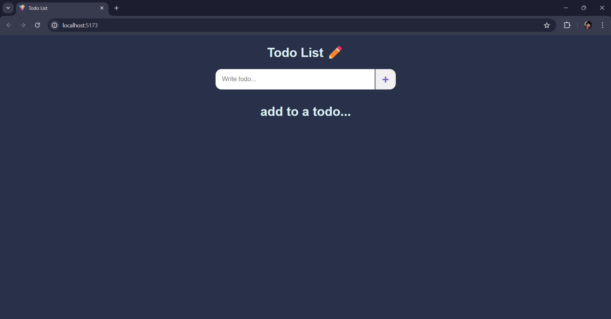
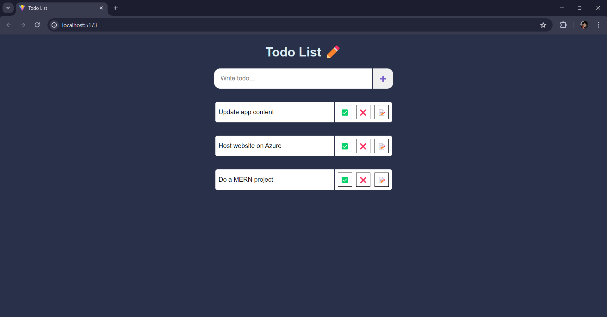
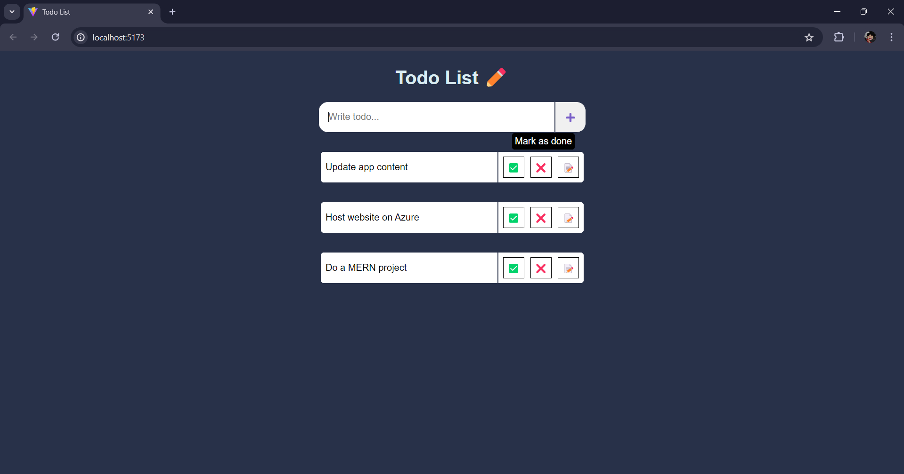
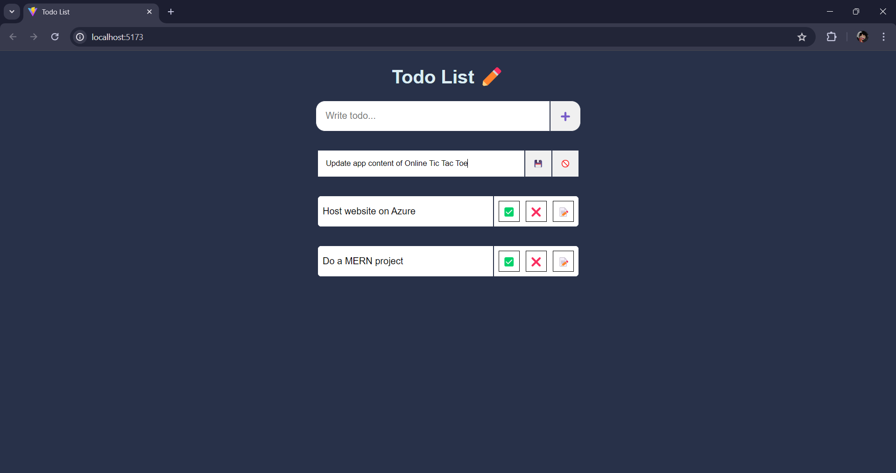

# React Todo List

This project is a simple Todo List application built using React. It was created as a learning exercise to understand the basics of React, including state management, event handling, and component-based architecture.

## Features

- Add new todos
- Edit existing todos
- Mark todos as done
- Delete todos
- Hover over buttons to see tooltips indicating their functions

## Installation

1. Clone the repository:

    ```bash
    git clone https://github.com/Massamba505/react-todo-list.git
    ```

2. Navigate to the project directory:

    ```bash
    cd react-todo-list
    ```

3. Install the dependencies:

    ```bash
    npm install
    ```

4. Start the development server:

    ```bash
    npm run dev
    ```

The application will be available at [http://localhost:5173](http://localhost:5173).


## Usage

- To add a new todo, type in the input field and click the "Add" button.
- To edit a todo, click the "Edit" button (📝), make your changes, and then save (💾) or cancel (🚫).
- To mark a todo as done, click the "Done" button (✅).
- To delete a todo, click the "Delete" button (❌).

## Learning Objectives

This project was created to achieve the following learning objectives:

- Understand the basics of React and its component-based architecture.
- Learn how to manage state using the `useState` hook.
- Implement event handling in React components.
- Style React components using CSS.
- Implement conditional rendering in React.
- Pass functions as props to child components.
- Use tooltips to enhance user experience.

## Gameplay Demo
<div style="display: flex; flex-wap: wrap; flex-direction: column">
    
    
    
    
</div>